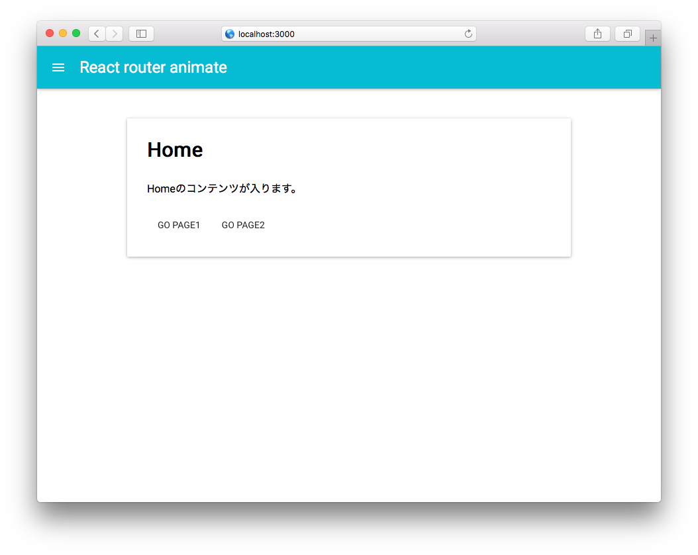

react-router-animate
====================



[Playground](http://tsuyoshiwada.github.io/react-samples/react-router-animate/)

[react-router](https://github.com/rackt/react-router)を使ったアニメーション付きのページ遷移サンプル。


## Install

```
$ git clone https://github.com/tsuyoshiwada/react-samples.git
$ cd react-sample/react-router-animate
$ npm install
```

## Run

以下コマンドを実行して、ブラウザで`http://localhost:3000`にアクセス。

```
$ npm start
```